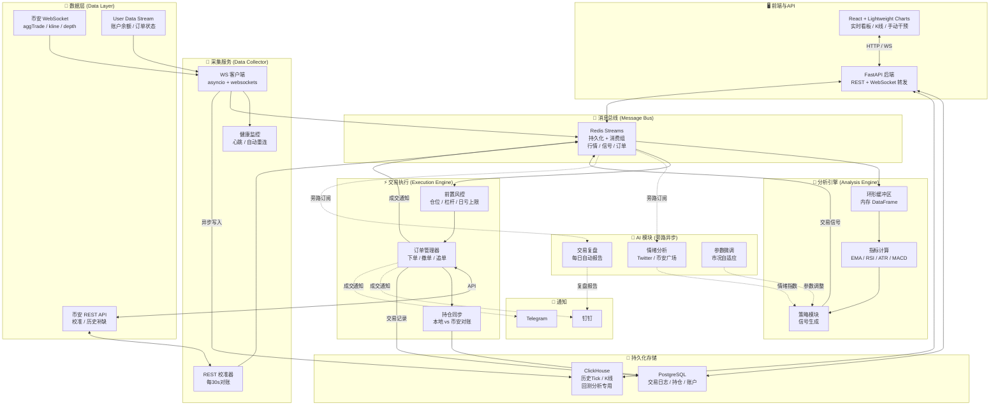
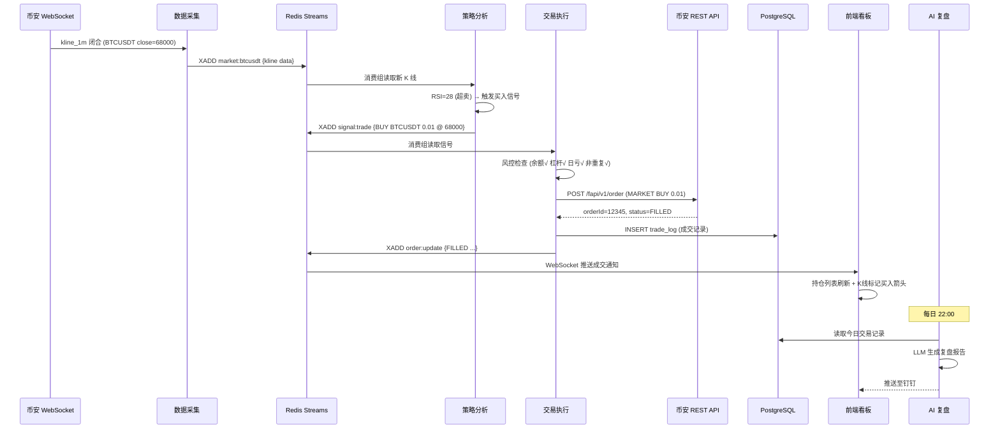

# 币安合约量化交易系统 — 架构设计 v2 (终稿)

> **版本**: v2.0 — 经过行业调研与横向对比后修订  
> **适用场景**: 中低频至中频策略（响应时间 50ms ~ 2s，持仓数分钟至数天）  
> **目标用户**: 个人 / 小型量化团队

---

## 1. 系统总体架构



---

## 2. 架构合理性验证（调研结论）

### 2.1 与行业标杆的对比验证

| 架构决策 | 本系统 | Freqtrade | Hummingbot V2 | 行业共识 |
|:---|:---|:---|:---|:---|
| 数据采集与策略解耦 | ✅ 通过 Redis 解耦 | ✅ CCXT Data Handler 独立 | ✅ Market Data Provider 独立 | **标准做法**：避免 I/O 阻塞计算 |
| 消息总线 | Redis Streams | 内部 Event Loop | Event Broker | **合理**：个人项目 Redis 即可；HFT 需 ZeroMQ |
| 执行与策略隔离 | ✅ 独立进程 | ✅ Order Manager 独立 | ✅ Executor 模式 | **关键设计**：策略崩溃不能影响止损 |
| 内存缓冲区 | Pandas Ring Buffer | SQLite 本地存储 | Cython OrderBook | **合理**：指标计算需要内存级速度 |
| AI 旁路异步 | ✅ 不在交易热路径 | ✅ FreqAI 独立线程 | N/A | **必须**：LLM 响应 1~5s，同步会拖垮系统 |

### 2.2 消息总线选型确认

调研对比三种方案后，确认 **Redis Streams** 是当前场景的最优选择：

| 方案 | 延迟 | 适用场景 | 本项目是否合适 |
|:---|:---|:---|:---|
| **共享内存 (SharedMemory)** | 纳秒级 | 同机 HFT，毫秒级套利 | ❌ 过度设计，调试困难 |
| **ZeroMQ** | 微秒级 | 跨机分布式低延迟 | ⚠️ 可以但无必要，个人项目维护成本高 |
| **Redis Streams** | 亚毫秒级 | 中频策略，需持久化和消费组 | ✅ **最佳平衡点**：延迟够低，自带持久化，支持消费者组，部署简单 |

> **关键改进 (v1 → v2)**：将 Redis Pub/Sub 改为 **Redis Streams**。  
> 原因：Pub/Sub 是"火烧即忘"模式，消费者离线期间的消息会丢失；Streams 支持消息持久化和消费者组确认（ACK），即使策略模块重启也不会丢信号。

### 2.3 时序数据库选型确认

| 数据库 | 最擅长 | 本项目是否合适 |
|:---|:---|:---|
| **InfluxDB** | 实时监控、告警 | ⚠️ 可以，但分析查询能力弱 |
| **TimescaleDB** | 需要 JOIN 关系数据的场景 | ⚠️ 可以，但需维护 PostgreSQL 扩展 |
| **ClickHouse** | 海量 Tick 数据存储 + 高速回测分析 | ✅ **最佳选择**：压缩比 10:1~30:1，扫描十亿行只需毫秒 |

> **结论**：历史行情用 **ClickHouse**，交易账务用 **PostgreSQL**，各司其职。

### 2.4 后端框架选型确认

| 框架 | 并发能力 | 开发速度 | 本项目结论 |
|:---|:---|:---|:---|
| Go Gin | 极强（goroutine 原生并发） | 中等 | 适合万级 WS 连接的大平台 |
| **FastAPI** | 良好（asyncio，足够千级连接） | **极快**（Python 生态直接复用） | ✅ **选定**：团队是 Python 栈，且连接数不超千级 |

### 2.5 AI 模块选型修订

调研发现 LangChain 在生产交易场景中存在**抽象过重、调试困难、依赖膨胀**的问题。修订如下：

| 原方案 | 修订方案 | 原因 |
|:---|:---|:---|
| LangChain + Celery | **直接调用 Gemini/OpenAI SDK + APScheduler** | LangChain 黑盒太重；直接 SDK 调用更可控、更轻量、延迟更低 |
| LLM 直接影响交易信号 | **LLM 仅输出"建议"，策略模块决定是否采纳** | LLM 存在幻觉风险，绝不能让 AI 直接下单 |
| 单一 AI Agent | **多专精 Agent（情绪 / 复盘 / 参数各一个）** | 单一 Agent 容易失焦，分工后更精准可控 |

---

## 3. 模块详细职责（修订版）

### 3.1 📡 数据采集 (Data Collector)

```
位置: /collector/
入口: collector/main.py
```

| 职责 | 细节 |
|:---|:---|
| WebSocket 多流复用 | 单连接订阅 `aggTrade` + `kline_1m` + `depth20@500ms` + `bookTicker` |
| REST 定时校准 | 每 30s 拉取最近 5 根 K 线，与内存比对，补漏 |
| User Data Stream | 订阅账户余额变更（含资金费率扣除）和订单状态更新 |
| 24h 重连 | 币安 WS 每 24h 强制断连，提前 5min 主动切换新连接（热切换） |
| 心跳监控 | 15s 无数据 → 主动断连重连（指数退避 1s→2s→4s→...→60s） |
| 数据输出 | → Redis Streams（实时分发）+ ClickHouse（异步持久化） |

### 3.2 🧠 分析引擎 & 策略 (Analysis & Strategy)

```
位置: /strategy/
入口: strategy/main.py
```

| 职责 | 细节 |
|:---|:---|
| 环形缓冲区 | 内存中维护最近 500 根 K 线的 DataFrame，新数据到来时滑动窗口更新 |
| 指标计算 | EMA / RSI / ATR / MACD / Bollinger / Volume Profile |
| 信号生成 | 标准化 JSON：`{"symbol", "action", "side", "quantity", "price", "sl", "tp", "reason"}` |
| 多策略支持 | 策略注册机制，可同时运行多个策略实例，各自独立评估信号 |
| AI 参数接收 | 从 Redis 读取 AI 模块写入的情绪指数和参数建议，策略自行决定是否采纳 |

### 3.3 ⚡ 交易执行 (Execution Engine)

```
位置: /executor/
入口: executor/main.py
```

| 职责 | 细节 |
|:---|:---|
| 前置风控 | 单笔最大金额、账户最大杠杆、日最大亏损、同方向重复信号去重 |
| 幂等性下单 | 每个信号附带唯一 `signal_id`，执行器维护 `pending_signals` 集合，防止重复下单 |
| 订单生命周期 | 挂单 → 追踪 → 部分成交 → 全部成交 / 超时撤单 |
| 持仓同步 | 每 60s 从币安 REST 拉取实际持仓，与本地状态比对，差异告警 |
| Rate Limiter | 接入令牌桶限流器，确保 REST 请求 < 1200 权重/分钟，HTTP 429 触发只读模式 |

### 3.4 🖥️ 前端 & API (Dashboard)

```
位置: /frontend/ (React)  +  /api/ (FastAPI)
```

| 职责 | 细节 |
|:---|:---|
| 实时看板 | 账户权益、持仓列表、今日盈亏、胜率、最大回撤 |
| K 线图 | TradingView Lightweight Charts，叠加买卖点标记和指标线 |
| 手动干预 | 一键全平、暂停策略、紧急市价单 |
| WS 推送 | FastAPI 后端从 Redis Streams 订阅，通过 WebSocket 转发至前端 |

### 3.5 🤖 AI 模块（旁路异步）

```
位置: /ai/
调度: APScheduler 定时任务
```

| Agent | 频率 | 输入 | 输出 |
|:---|:---|:---|:---|
| **情绪分析 Agent** | 每 4h | Twitter / 币安广场 / CryptoNews | 情绪指数 (-1 ~ +1) → Redis |
| **参数微调 Agent** | 每日 | 最近 7 天 K 线特征（波动率/趋势度） | 策略参数建议 → Redis |
| **交易复盘 Agent** | 每日 22:00 | PostgreSQL 交易记录 | 复盘报告 → 钉钉/Telegram |

> ⚠️ **铁律**：AI 输出的是**建议**，不是**指令**。策略模块保留最终决策权。AI 永远不能直接调用下单 API。

---

## 4. 项目目录结构

```
bxm40/
├── collector/              # 📡 数据采集服务
│   ├── main.py             #   启动入口
│   ├── ws_client.py        #   WebSocket 客户端（自动重连）
│   ├── rest_client.py      #   REST 校准器
│   ├── user_stream.py      #   User Data Stream 监听
│   └── health.py           #   健康监控
│
├── strategy/               # 🧠 分析引擎 & 策略
│   ├── main.py             #   启动入口
│   ├── ring_buffer.py      #   环形缓冲区
│   ├── indicators.py       #   技术指标计算
│   ├── base_strategy.py    #   策略基类
│   └── strategies/         #   具体策略实现
│       ├── ema_cross.py
│       └── breakout.py
│
├── executor/               # ⚡ 交易执行器
│   ├── main.py             #   启动入口
│   ├── risk_manager.py     #   前置风控
│   ├── order_manager.py    #   订单管理
│   ├── position_sync.py    #   持仓同步
│   └── rate_limiter.py     #   API 限流器
│
├── api/                    # 🖥️ 后端 API
│   ├── main.py             #   FastAPI 启动
│   ├── routes/
│   │   ├── account.py      #   账户信息
│   │   ├── trades.py       #   交易记录
│   │   └── control.py      #   手动干预（平仓/暂停）
│   └── ws_handler.py       #   WebSocket 推送
│
├── frontend/               # 🖥️ React 前端
│   ├── src/
│   │   ├── components/
│   │   │   ├── Dashboard.jsx
│   │   │   ├── Chart.jsx
│   │   │   └── TradeList.jsx
│   │   └── App.jsx
│   └── package.json
│
├── ai/                     # 🤖 AI 旁路模块
│   ├── sentiment.py        #   情绪分析 Agent
│   ├── reviewer.py         #   交易复盘 Agent
│   ├── tuner.py            #   参数微调 Agent
│   └── scheduler.py        #   APScheduler 调度器
│
├── common/                 # 🔧 公共模块
│   ├── config.py           #   全局配置（环境变量读取）
│   ├── redis_client.py     #   Redis 连接封装
│   ├── db.py               #   PostgreSQL 连接
│   ├── clickhouse.py       #   ClickHouse 连接
│   ├── logger.py           #   统一日志
│   └── notify.py           #   钉钉 / Telegram 通知
│
├── docker-compose.yml      #   一键启动 Redis + ClickHouse + PostgreSQL
├── .env.example            #   环境变量模板（API Key 等）
├── requirements.txt        #   Python 依赖
├── architecture_design.md  #   本文档
└── research_notes.md       #   调研报告
```

---

## 5. 数据流全链路（BTC 做多示例）



---

## 6. 开发计划（修订版）

| 阶段 | 内容 | 预计周期 | 交付物 |
|:---|:---|:---|:---|
| **Phase 1** | 数据采集 + Redis + ClickHouse 落地 | 1 周 | `collector/` 完整可运行 |
| **Phase 2** | 交易执行器 + 风控 + 持仓同步 | 1 周 | `executor/` 模拟盘跑通 |
| **Phase 3** | 均线交叉策略，打通全链路闭环 | 3 天 | `strategy/` 信号→下单验证通过 |
| **Phase 4** | FastAPI + React 前端看板 | 1 周 | 可视化看板上线 |
| **Phase 5** | AI 情绪分析 + 每日复盘 | 3 天 | 钉钉自动推送复盘报告 |
| **Phase 6** | Docker Compose 一键部署 + 监控 | 2 天 | 生产级部署方案 |
