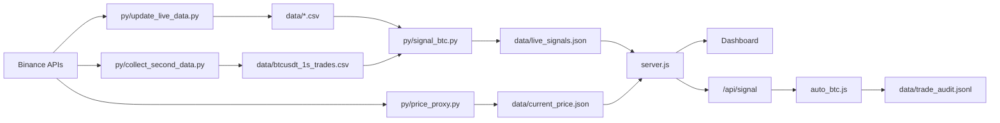

# BTC Binary Options 新架构文档

本文档是当前项目唯一架构说明。旧 2m/30m/POC 研究脚本和旧报告文档已经移除，后续不要再新增分散的临时回测入口。

## 当前目标

- 线上只保留清晰的实盘链路：数据采集 -> 信号生成 -> 服务端展示/配置 -> Pad 执行 -> 订单记录/结算。
- 研究只保留 1 秒 K 线回测框架，用同一套执行口径比较参数。
- 两个不同策略独立运行，不做全局去重；同一策略 10 分钟内只允许一单。

## 运行入口

| 功能 | 文件/命令 |
| --- | --- |
| Node 服务端/API/前端静态资源 | `server.js` / `npm start` |
| 前端源码 | `frontend/src` |
| Pad 自动下单脚本 | `auto_btc.js` |
| 信号服务 | `py/signal_btc.py` |
| 1m/taker/LS/funding 数据更新 | `py/update_live_data.py` |
| 1 秒 K 线采集 | `py/collect_second_data.py` |
| 当前价格代理 | `py/price_proxy.py` |
| 秒级回测 CLI | `py/run_second_backtest.py` |
| 秒级算法研究 CLI | `py/run_second_research.py` / `npm run research:second` |
| 秒级回测框架 | `py/second_backtest/` |
| 部署脚本 | `tools/deploy_linux.ps1` |

## 线上数据流



## 策略配置

配置来源：

- 用户页面保存到 `data/trade_config.json`
- 服务端同步生成 `data/prod_config.json`
- 信号服务读取 `data/prod_config.json`

当前策略类型：

- `second_normal`：秒级正态尾部反转。当前主参数：`lookbackSec=4200`、`tailPct=0.22`、`horizonSec=600`、`gapSec=1200`、默认实盘 `10U`。
- `second_chip`：秒级筹码区突破反转。当前主参数：`lookbackSec=3600`、`chipTargetShare=0.2`、`chipBinSize=100`、`chipBreakPct=0.005`、`chipFilter=flow_reversal`、`gapSec=600`、默认实盘 `15U`。
- `poc_normal`：旧 POC/正态分钟级策略仍在 `py/signal_btc.py` 内支持，但默认不开启，只用于兼容旧配置。

策略金额在前端配置里按策略单独设置。实盘执行时，`auto_btc.js` 根据 `_strategyVariants` 和 `/api/signal` 返回的策略 ID 匹配金额。

## 执行规则

Pad 执行规则在 `auto_btc.js`：

- 只执行 `tradeEnabled=true` 的策略。
- 信号必须未过期，默认最大延迟 60 秒。
- 同一策略下单后锁到到期时间，当前 10 分钟周期就是锁 10 分钟。
- 不同策略不互相全局去重。
- 多个策略同一时间有信号时，按信号可执行时间和页面策略配置顺序排队下单，并在审计里记录具体 `strategyId`。
- 下单成功后记录到 `trade_audit.jsonl`，服务端再用于展示和结算。
- Pad 每分钟上报保活状态：屏幕是否亮、是否有修改系统设置权限、系统熄屏时间、是否忽略电池优化。黑屏优先查 `/api/tablet-diagnostics`。

服务端影子单/模拟结算在 `server.js`：

- 真实单和影子单分开统计。
- 10 分钟二元期权按 80% 赔付，30 分钟按 85% 赔付。
- 真实实盘是否允许由页面配置 `realTradingEnabled && autoTrade_10m` 控制，不再依赖已删除的旧 shadow decision 报告。

## 秒级回测框架

统一入口：

```powershell
npm run backtest:second
```

本地等价命令会使用 `py/run_second_backtest.py` 内置默认 CSV，当前默认指向最近拉取的 `tmp/latest_1s_pull_*/btcusdt_1s_trades.csv`。

服务器/生产数据命令：

```powershell
python py\run_second_backtest.py --csv data\btcusdt_1s_trades.csv --out data\second_backtest_report_latest.json
```

研究默认组合：

```powershell
npm run backtest:second:defaults
```

算法研究扫描：

```powershell
npm run research:second
```

研究报告默认输出：`tmp/second_algorithm_research_latest.json`。它只读 1 秒 K 线数据，不会修改线上配置；用于比较正态尾部、方向型正态、筹码区、VWAP 偏离、资金流背离等候选算法。

指定 CSV：

```powershell
python py\run_second_backtest.py --csv data\btcusdt_1s_trades.csv --out data\second_backtest_report_latest.json
```

报告输出：

- 默认输出：`tmp/second_backtest_report_latest.json`
- 服务端刷新报告输出：`data/second_backtest_report_latest.json`
- API：`GET /api/reports` 返回 `secondBacktest`
- 手动刷新：`POST /api/reports/refresh`

### 回测口径

每个策略报告包含：

- `rawSignals`：策略裸信号，不代表能实际下单。
- `liveExecution`：当前 Pad 实盘执行口径，同策略锁 10 分钟，不做全局去重。
- `configuredGapExecution`：先按配置的 gap 过滤，再执行同策略锁，用于复现旧参数研究。

数据只使用 1 秒 K 线。缺失秒以前一秒 close 补齐，成交量记为 0。报告会输出缺失率、重复秒、最大断层。

## 当前文件边界

保留的 Python 文件分三类：

- 生产：`signal_btc.py`、`update_live_data.py`、`collect_second_data.py`、`price_proxy.py`
- 兼容依赖：`backtest_enhanced.py`，当前 `signal_btc.py` 仍用它构建旧 POC 特征
- 研究：`run_second_backtest.py`、`run_second_research.py`、`second_backtest/`

不要再新增：

- `tmp/*.py` 临时研究脚本
- 新的 2m/30m/POC 搜索脚本
- 重复的 strategy report / shadow decision 报告脚本
- 和 `py/second_backtest` 功能重复的回测函数

如果要新增策略，先在 `py/second_backtest/strategies.py` 加可回测版本，再在 `py/signal_btc.py` 加线上版本，并在文档里说明参数映射。

## 部署前检查

```powershell
python -m py_compile py\signal_btc.py py\update_live_data.py py\collect_second_data.py py\price_proxy.py py\backtest_enhanced.py py\run_second_backtest.py py\run_second_research.py py\second_backtest\__init__.py py\second_backtest\data.py py\second_backtest\execution.py py\second_backtest\metrics.py py\second_backtest\strategies.py py\second_backtest\research.py
python -m unittest test_second_backtest.py
npm test
npm run frontend:build
```

部署：

```powershell
.\tools\deploy_linux.ps1 -ServerHost 115.190.218.128 -ServerUser root
```

## 运维检查

本地或服务器启动后检查：

- `GET /api/runtime`：服务、数据目录、脚本版本。
- `GET /api/second-data-health`：1 秒数据采集状态。
- `GET /api/data-health`：1m/taker/LS/funding 数据新鲜度。
- `GET /api/signal`：当前策略信号。
- `GET /api/trade-history`：真实单和影子单统计。
- `GET /api/reports`：最新秒级回测报告。

出现长时间无信号时，先看 `/api/signal` 的每个策略 `reason`，再用 `npm run backtest:second` 对同一份 1 秒数据复验，判断是行情无信号、数据断层，还是执行锁/信号过期。
