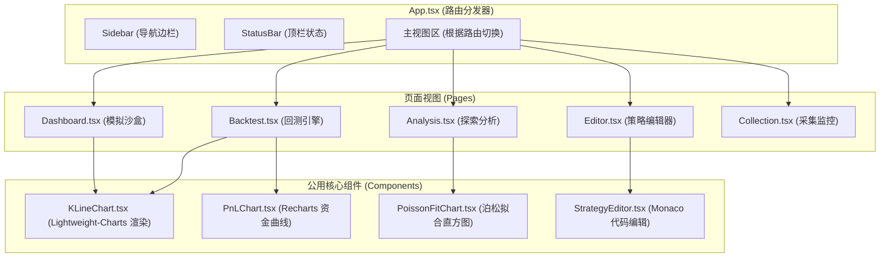

# BXM40 前端路由设计与专业化 UI/UX 规范 (量化分析优先)

本规范基于行业主流量化终端（如 **FreqUI**, **Hummingbot Dashboard**, **TradingView Premium**）的界面交互调研，结合本项目**“数据管理、研究、回测、模拟沙盒”**的优先定位，制定出本套专业化前端设计规范与路由规划。

---

## 🧭 1. 路由与功能页面规划 (Route Mapping)

系统划分为 **5 大核心路由**。为保证极佳的单页应用加载速度与稳定性，建议使用 **React State-based Router** 或 **Hash Router**（通过 `window.location.hash` 切换），以避免在 Nginx 容器部署中出现 HTML5 History API 的 `404 Not Found` 刷新配置问题。

| 路由路径 | 页面名称 | 英文名称 | 核心专业组件 (Widgets) | 职责 |
| :--- | :--- | :--- | :--- | :--- |
| `#/` | **模拟交易沙盒** | Sandbox Dashboard | KLineChart, PositionGrid, MockOrderForm, MockLedger | 实时模拟交易，利用 WS 行情和内存数据库跑策略 |
| `#/backtest` | **回测工作室** | Backtest Studio | ParameterForm, NavCurveChart, DrawdownChart, SignalMarkerKLine, TradeReportCard | 点击触发 ClickHouse 历史数据回测，展示专业绩效指标及买卖标记 |
| `#/analysis` | **量价数据分析** | Market EDA | PoissonFitHistogram, AutocorrelationPlot, CorrelationMatrix | 对 ClickHouse 的 Tick 与 K 线进行统计学探索，校验成交量异常度 |
| `#/editor` | **策略编辑器** | Strategy IDE | MonacoCodeEditor, StrategyFileTree, ParamSliderConfig | 在线编写/预览 Python 策略代码，微调风险参数，点击即时重启热载 |
| `#/collection` | **数据采集监控** | Data Manager | CollectorStatusCard, RedisStreamMonitor, SyncCompensatorForm | 实时查看 WS 消息率、ClickHouse 缓存队列与磁盘空间，并支持手动对账补写 |

---

## 🎨 2. 专业化 UI/UX 展现规范 (Trading Terminal Style Guide)

专业的金融与量化交易界面有其独特的交互逻辑，**最忌讳业余的明亮花哨色、无意义的布局空白以及不固定的文字宽度**。以下是设计细则：

### 2.1 高紧凑网格布局 (Compact Grid Layout)
*   **不留白原则**: 交易员需要单屏展示尽可能多的有效指标。采用 `display: grid` 或 `flex` 使得组件铺满屏幕，禁止大面积的空白。
*   **固定高度与滚动条**: 为日志组件、交易表格等设置 `max-height` 并使用 `overflow-y: auto`。滚动条样式要定制为极窄暗灰色，不能使用浏览器默认的宽滚动条。

### 2.2 严格的配色控制 (Sleek Dark Scheme)
*   **深色底色**: 主背景使用 `#090D16`，卡片背景使用 `#101625`，卡片边框采用高对比细边框 `#1C253B`。
*   **成交方向淡色化**: 
    *   **做多 / 盈利 / 启动**: `#0ECB81` (翠绿)。数值文字只在发生变化时短暂闪烁，不要把整个单元格标绿。
    *   **做空 / 亏损 / 停止**: `#F6465D` (亮红)。
    *   **异常 / 泊松触发 / 警报**: `#B168FA` (霓虹紫)。
*   **文字阶梯度 (Text Hierarchy)**:
    *   主数字 / 主数值: `#EAECEF` (极亮白灰)
    *   标签 / 描述文案: `#848E9C` (灰底)
    *   次要信息 / 占位符: `#474F5A` (深灰)

### 2.3 等宽字体保障 (Numeric Mono-space)
*   任何展示价格、资产余额、数量、收益率的地方，**必须**使用等宽字体（Monospace）。
*   *推荐 font-family*: `"Roboto Mono", "Courier New", Courier, monospace`
*   *原因*: 非等宽字体在数字高频跳动（如秒级价格更新）时，会导致字符宽度变化，引发整行甚至整栏排版不停晃动，影响视觉专注。

### 2.4 数据闪烁反馈 (Price Tick Feedback)
*   每当收到 WS 的 K 线最新成交价（Tick）时：
    *   如果价格相比上一次上涨，可在价格文字后显示微缩的绿色向上三角符号 `▲`，或者边框短暂高亮淡绿色 `rgba(14, 203, 129, 0.15)` 并渐隐。
    *   如果价格相比上一次下跌，显示红色向下三角符号 `▼`，或边框短暂高亮淡红色 `rgba(246, 70, 93, 0.15)` 并渐隐。

---

## 🧱 3. 核心组件开发规范 (Component Architecture)

前端项目中的组件开发必须遵循单一职责和严格的接口设计：

---

## 🛠️ 4. 具体开发落地计划

### 第一步：设置 Hash 路由管理
在 `frontend/src/App.tsx` 中移除原来的固定三栏布局，引入状态驱动的 Hash 路由器，使页面支持五个独立视图切换。

### 第二步：统一排版 CSS 变量
在 `frontend/src/index.css` 中注入专业交易系统的全局样式、等宽数值字体规范、深色主题背景以及极窄滚动条样式。

### 第三步：重构/编写 5 大组件页面
1.  **数据采集管理 (`Collection.tsx`)**:
    *   实现一键补齐 ClickHouse 数据表单。
    *   可视化采集延迟。
2.  **量价数据分析 (`Analysis.tsx`)**:
    *   实现 K 线 1m 周期成交量的柱状图，计算并拟合泊松曲线。
3.  **策略代码编辑 (`Editor.tsx`)**:
    *   动态读取并编辑 `strategy/strategies/` 目录下的 Python 策略。
4.  **回测工作室 (`Backtest.tsx`)**:
    *   编写包含时间段、佣金等回测表单，运行后轮询 API 并以 `Recharts` 双折线（NAV 曲线 & MDD 曲线）呈现。
5.  **模拟沙盒交易 (`Dashboard.tsx`)**:
    *   保留旧版本的持仓和资产概览，但将其切换为仅消费实时虚拟撮合的消息，脱离实盘。
